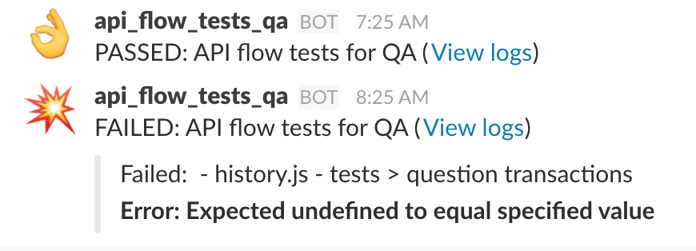

# mocha-ci-slack-reporter

Slack reporter for Mocha when running in CI environments.

Although this can be used in non-CI environments too, it is suited for CI
environment in that it is able to report build number, build URL, etc alongside
standard test pass/failed information.

It posts a single pretty notification to your Slack channel with a summary of
the test failures and/or successful run.

What it looks like:



## Installation

```shell
$ npm install mocha-ci-slack-reporter
```

## Usage

All options:

* `testTitle` - (mandatory) Title of test in report
* `url` (mandatory) - Slack incoming webhook URL
* `username` (mandatory) - Username to post as
* `channel` (mandatory) - Channel to post to
* `logsUrl` - URL to logs page, appended to message text (default is undefined)
* `passEmoji` - Emoji to use for test pass (default is :ok_hand:)
* `failEmoji` - Emoji to use for test failure (default is :bomb:)
* `failuresOnly` - Whether to only report failures (default is `false`)

### via Command-line

```shell
$ mocha test --reporter mocha-ci-slack-reporter  --reporter-options username=name,channel=#channel_name,...
```

### via API

```javascript
var mocha = new Mocha({
  reporter: 'mocha-ci-slack-reporter',
  reporterOptions: {
    testTitle: 'My tests',
    url: 'https://hooks.slack.com/...',
    username: 'reporter',
    channel: '#mychannel',
    logsUrl: 'https://ci.com/project/...'
  }
});
```

## License

MIT - see [LICENSE.md](LICENSE.md)
